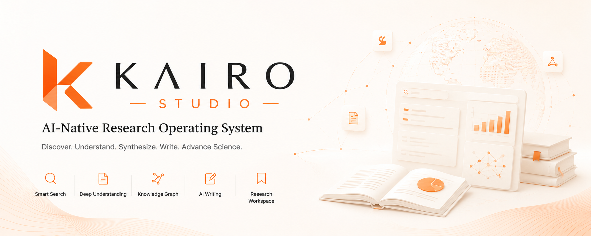

  

# Kairo Studio

**AI-native Research Workspace**

Go from research idea to literature review to publication in one intelligent workspace.

## Vision

Kairo Studio is an AI-native research environment that helps researchers, students, engineers, and scientists perform the entire research workflow without switching between multiple tools. Instead of using separate platforms for searching papers, reading PDFs, writing literature reviews, managing citations, and drafting manuscripts, Kairo Studio combines everything into one collaborative AI workspace.

The long-term vision is to become the ultimate workspace for research, enabling humans and AI agents to collaborate throughout the entire research lifecycle.

## Problem & Solution

Today's research workflow is highly fragmented across tools like Google Scholar, Zotero, Overleaf, Obsidian, and AI chatbots. Information becomes scattered, and context is lost.

Kairo Studio centralizes the research workflow. Users can discover papers, organize projects, understand complex literature, generate reviews, identify gaps, and draft manuscripts. Rather than replacing researchers, Kairo Studio acts as an intelligent collaborator. The human remains the author, while the AI acts as the accelerator.

## Core Features

- **Research Workspace:** Manage multiple research projects, storing papers, notes, citations, conversations, and drafts.
- **AI Paper Search:** Search academic databases (arXiv, Semantic Scholar, OpenAlex) using natural language.
- **Paper Library:** Organize papers into collections, complete with metadata, extracted text, embeddings, and notes.
- **AI Reading & Chat:** Interact with single or multiple papers to summarize sections, explain equations, and answer specific questions with cited evidence.
- **Literature Review Generator:** Automatically generate comprehensive literature reviews from selected papers, complete with supporting citations.
- **Research Gap Finder:** Analyze literature to find unexplored problems, inconsistent findings, and evaluation weaknesses.
- **AI Paper Writer & Citation Manager:** Draft academic writing with cited evidence and automatically generate citations in various formats (APA, IEEE, ACM, BibTeX, RIS).
- **Research Notes & Export:** Markdown-based note-taking with equations and Mermaid support, exportable to PDF, DOCX, Markdown, and LaTeX.

## Multi-Agent Architecture

Kairo Studio is built on a specialized multi-agent architecture rather than a single monolithic AI. Specialized agents handle specific tasks:
- **Planner Agent:** Understands user goals, plans workflows, and decides which agents to invoke.
- **Search & Retrieval Agents:** Fetches relevant papers, retrieves PDFs, and extracts metadata.
- **Reading & Evidence Agents:** Summarizes content, performs Q&A, and verifies supporting passages.
- **Literature Review & Gap Analysis Agents:** Synthesizes findings and identifies research opportunities.
- **Writing & Reviewer Agents:** Drafts sections, improves writing, and provides critical feedback simulating conference reviewers.
- **Citation Agent:** Manages bibliography and formatting.

## Technology Stack

- **Frontend:** Next.js, React, Tailwind CSS, shadcn/ui, Framer Motion
- **Backend:** FastAPI, Python, PostgreSQL, Redis
- **AI Models:** OpenAI, Anthropic Claude, Gemini, LiteLLM
- **Retrieval & Search:** Qdrant, pgvector, Voyage AI embeddings, OpenAlex/Semantic Scholar APIs
- **Document Processing:** PyMuPDF, GROBID, Unstructured, Docling

## Design Principles

- **Evidence First:** Every generated statement is traceable and backed by citations. No hallucinated citations.
- **Human in Control:** Users approve every major generation. Nothing is hidden.
- **Project-Based:** Everything belongs inside projects. Context persists across sessions.
- **AI-Native:** The interface is designed around AI collaboration, not traditional document editing.
- **Research-Centric:** Every feature exists because it improves research quality.
