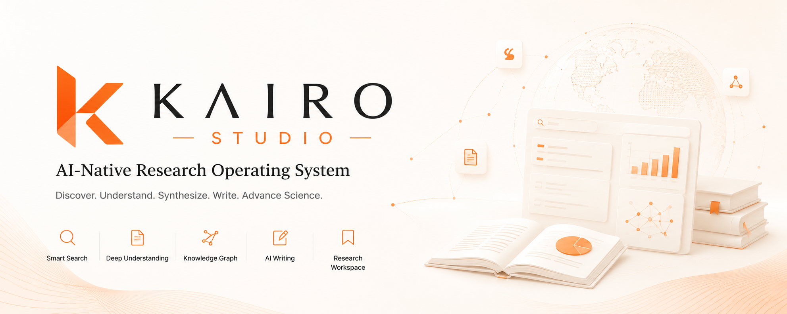

<div align="center">
  
</div>

# Kairo Studio

**AI-native Research Workspace**

Go from research idea to literature review to publication in one intelligent workspace.

## Vision

Kairo Studio is an AI-native research environment that helps researchers, students, engineers, and scientists perform the entire research workflow without switching between multiple tools. Instead of using separate platforms for searching papers, reading PDFs, writing literature reviews, managing citations, and drafting manuscripts, Kairo Studio combines everything into one collaborative AI workspace.

The long-term vision is to become the ultimate workspace for research, enabling humans and AI agents to collaborate throughout the entire research lifecycle.

## Problem & Solution

Today's research workflow is highly fragmented across tools like Google Scholar, Zotero, Overleaf, Obsidian, and AI chatbots. Information becomes scattered, and context is lost.

Kairo Studio centralizes the research workflow. Users can discover papers, organize projects, understand complex literature, generate reviews, identify gaps, and draft manuscripts. Rather than replacing researchers, Kairo Studio acts as an intelligent collaborator. The human remains the author, while the AI acts as the accelerator.

## Core Features

- **Research Workspace:** Manage multiple research projects, storing papers, notes, citations, conversations, and drafts.
- **AI Paper Search:** Search academic databases (arXiv, Semantic Scholar, OpenAlex) using natural language.
- **Paper Library:** Organize papers into collections, complete with metadata, extracted text, embeddings, and notes.
- **AI Reading & Chat:** Interact with single or multiple papers to summarize sections, explain equations, and answer specific questions with cited evidence.
- **Literature Review Generator:** Automatically generate comprehensive literature reviews from selected papers, complete with supporting citations.
- **Research Gap Finder:** Analyze literature to find unexplored problems, inconsistent findings, and evaluation weaknesses.
- **AI Paper Writer & Citation Manager:** Draft academic writing with cited evidence and automatically generate citations in various formats (APA, IEEE, ACM, BibTeX, RIS).
- **Research Notes & Export:** Markdown-based note-taking with equations and Mermaid support, exportable to PDF, DOCX, Markdown, and LaTeX.

## Multi-Agent Architecture

Kairo Studio is built on a specialized multi-agent architecture rather than a single monolithic AI. Specialized agents handle specific tasks:
- **Planner Agent:** Understands user goals, plans workflows, and decides which agents to invoke.
- **Search & Retrieval Agents:** Fetches relevant papers, retrieves PDFs, and extracts metadata.
- **Reading & Evidence Agents:** Summarizes content, performs Q&A, and verifies supporting passages.
- **Literature Review & Gap Analysis Agents:** Synthesizes findings and identifies research opportunities.
- **Writing & Reviewer Agents:** Drafts sections, improves writing, and provides critical feedback simulating conference reviewers.
- **Citation Agent:** Manages bibliography and formatting.

## Technology Stack

- **Frontend:** Next.js, React, Tailwind CSS, shadcn/ui, Framer Motion
- **Backend:** FastAPI, Python, PostgreSQL, Redis
- **AI Models:** OpenAI, Anthropic Claude, Gemini, LiteLLM
- **Retrieval & Search:** Qdrant, pgvector, Voyage AI embeddings, OpenAlex/Semantic Scholar APIs
- **Document Processing:** PyMuPDF, GROBID, Unstructured, Docling

## How to Setup

### 1. Prerequisites
Ensure you have the following installed on your system before setting up Kairo Studio:
- **Node.js** (v18+ or v20+) & **npm**
- **Python** (v3.11+)
- **uv** (Fast Python package manager) — *Can be installed via `pip install uv`*
- **Docker & Docker Desktop** (Required for PostgreSQL with pgvector and Redis)
- **Git**

---

### 2. Quick Start (Automated 1-Click Setup) 🚀
The easiest way to start all services (Docker databases, Backend API, and Frontend development server) is using the included automated startup scripts:

#### For Windows:
Simply run the batch script from your terminal or double-click it in File Explorer:
```cmd
.\start-all.bat
```

#### For Linux / macOS:
Make the script executable and run it:
```bash
chmod +x start-all.sh
./start-all.sh
```

*The automated script will automatically check dependencies, sync Python packages via `uv`, install Node modules, clear any stale port locks (3000 & 8000), and launch the frontend and backend simultaneously.*

---

### 3. Manual Step-by-Step Setup 🛠️
If you prefer running services manually in separate terminal windows:

#### Step 1: Start Database & Cache Services
Make sure Docker Desktop is running, then start PostgreSQL and Redis from the project root:
```bash
docker compose up -d
```

#### Step 2: Configure Environment Variables
Copy the example environment files and configure your API keys (OpenAI, Anthropic, Gemini, etc.):
- In `backend/`: Copy `.env.example` to `.env`
- In `frontend/`: Copy `.env.example` (or configure `.env.local`)

#### Step 3: Start the Backend API Server
Open a terminal, navigate to the `backend` directory, install dependencies, and start Uvicorn:
```bash
cd backend
uv sync
uv run uvicorn main:app --reload --host 0.0.0.0 --port 8000
```
*The Backend API will be available at `http://localhost:8000` and interactive Swagger docs at `http://localhost:8000/docs`.*

#### Step 4: Start the Frontend Application
Open a second terminal, navigate to the `frontend` directory, install packages, and start Next.js:
```bash
cd frontend
npm install
npm run dev
```
*The Kairo Studio web interface will now be running at `http://localhost:3000`.*

## Design Principles

- **Evidence First:** Every generated statement is traceable and backed by citations. No hallucinated citations.
- **Human in Control:** Users approve every major generation. Nothing is hidden.
- **Project-Based:** Everything belongs inside projects. Context persists across sessions.
- **AI-Native:** The interface is designed around AI collaboration, not traditional document editing.
- **Research-Centric:** Every feature exists because it improves research quality.
